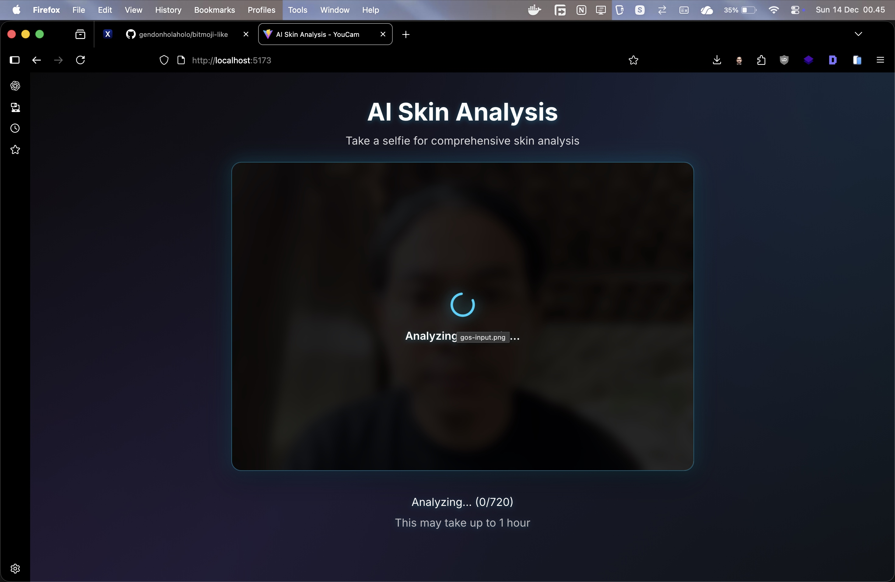
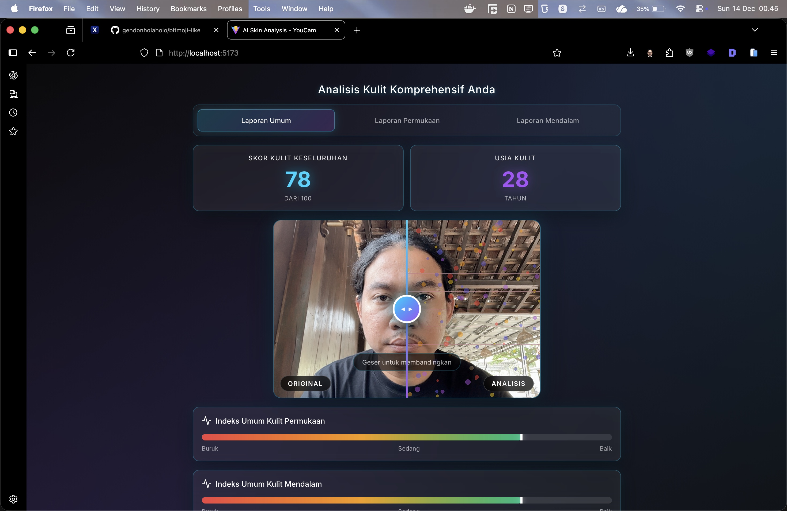
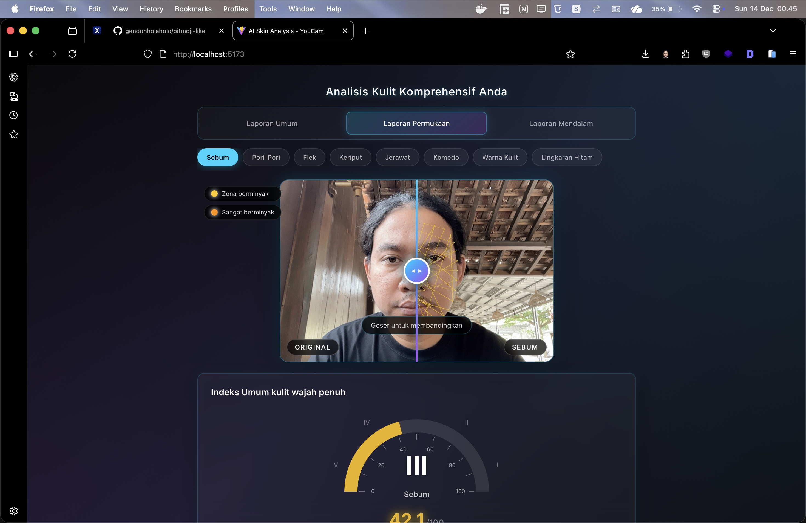
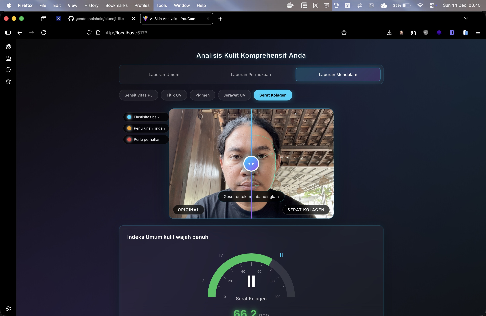

# AI Skin Analysis - YouCam

**AI Skin Analysis** adalah aplikasi web canggih yang memberikan analisis kulit komprehensif menggunakan kecerdasan buatan. Aplikasi ini mengintegrasikan teknologi computer vision dengan AI untuk mendeteksi dan menganalisis berbagai kondisi kulit secara mendalam, menyajikan hasil dalam tiga kategori laporan yang terstruktur.

## Tinjauan Proyek

Proyek ini dikembangkan sebagai demonstrasi kemampuan **Fullstack Development** dan **Advanced Computer Vision Engineering**. Pembaruan besar ini menghadirkan sistem analisis kulit yang lebih komprehensif dengan tiga jenis laporan terpisah dan fitur perbandingan visual interaktif.

### Evolusi Arsitektur (v1 → v2)

Aplikasi ini telah mengalami transformasi signifikan dari pendekatan awal:

| Aspek | v1 (Archived) | v2 (Current) |
|-------|---------------|--------------|
| **Visualisasi** | Single overlay map dengan color coding | Comparison slider interaktif per parameter |
| **Laporan** | Dashboard tunggal | 3 laporan terstruktur (Umum, Permukaan, Mendalam) |
| **AI Engine** | Basic image processing | MediaPipe + GPT Integration |
| **Metrik** | 7 parameter dasar | 13+ parameter komprehensif |
| **UX** | Static result display | Interactive gauge & slider |

> **Catatan**: Screenshot dan dokumentasi pendekatan v1 diarsipkan di folder `assets/artefacts/` untuk referensi historis. Aplikasi saat ini menggunakan arsitektur v2 yang sepenuhnya berbeda.

### Demonstrasi Keahlian (Developer Capabilities)

Saya (**Ghaws Shafadonia**) mengembangkan solusi ini untuk membuktikan kompetensi dalam ranah high-level engineering:

*   **Fullstack Architecture Mastery**: Membangun jembatan yang kokoh antara backend yang kompleks (pemrosesan data AI, MediaPipe, GPT integration) dan frontend yang responsif.
*   **Computer Vision & AI Engineering**: Mengintegrasikan MediaPipe untuk landmark detection dan GPT untuk analisis cerdas, memproses data visual mentah menjadi wawasan dermatologis yang presisi.
*   **Advanced UI/UX Implementation**: Menerjemahkan kebutuhan data yang rumit menjadi dashboard visual yang estetik dengan comparison slider interaktif dan gauge visualization.
*   **Complex State Management**: Menangani flow asinkronus real-time dengan progress tracking untuk memberikan feedback instan kepada pengguna.

## Fitur Utama

- **Analisis Kulit AI Komprehensif**: Mendeteksi 13+ parameter kulit dengan presisi tinggi
- **Tiga Jenis Laporan Terstruktur**:
  - **Laporan Umum**: Skor keseluruhan dan estimasi usia kulit
  - **Laporan Permukaan**: Analisis 8 parameter kulit permukaan
  - **Laporan Mendalam**: Analisis 5 parameter kondisi kulit dalam
- **Interactive Comparison Slider**: Bandingkan gambar original dengan hasil analisis secara real-time
- **Semi-Circular Gauge Visualization**: Visualisasi skor yang intuitif dan mudah dipahami
- **Lokalisasi Bahasa Indonesia**: Antarmuka sepenuhnya dalam Bahasa Indonesia

## Galeri Demonstrasi

Berikut adalah tampilan antarmuka aplikasi yang telah dikembangkan:

### 1. Antarmuka Pengambilan Selfie

| Selfie Capture Mode |
| :---: |
|  |

*Antarmuka "Take a Selfie" dengan desain futuristik, siap untuk memindai wajah pengguna.*

### 2. Proses Analisis AI

| AI Analysis Process |
| :---: |
|  |

*Visualisasi proses analisis AI dengan progress tracking real-time. Sistem memproses hingga 720 frame untuk hasil yang akurat.*

### 3. Laporan Umum (General Report)

| Comprehensive Overview |
| :---: |
|  |

*Dashboard Laporan Umum menampilkan Skor Kulit Keseluruhan dan Estimasi Usia Kulit. Dilengkapi dengan comparison slider untuk membandingkan gambar original dengan hasil analisis.*

### 4. Laporan Permukaan (Surface Analysis)

| Surface Skin Analysis |
| :---: |
|  |

*Laporan Permukaan menganalisis 8 parameter kulit: Sebum, Pori-Pori, Flek, Keriput, Jerawat, Komedo, Warna Kulit, dan Lingkaran Hitam. Setiap parameter memiliki visualisasi overlay dan gauge score tersendiri.*

### 5. Laporan Mendalam (Deep Analysis)

| Deep Skin Analysis |
| :---: |
|  |

*Laporan Mendalam menganalisis kondisi kulit di bawah permukaan: Sensitivitas PL, Titik UV, Pigmen, Jerawat UV, dan Serat Kolagen. Dilengkapi dengan indikator status kesehatan (Elastisitas baik, Penurunan ringan, Perlu perhatian).*

---

## Skin Analysis Metrics

Sistem ini mampu mendeteksi dan menganalisis metrik kulit secara mendetail dalam tiga kategori:

### Laporan Umum
| Metrik | Deskripsi |
|--------|-----------|
| **Skor Kulit Keseluruhan** | Nilai agregat kesehatan kulit (0-100) |
| **Usia Kulit** | Estimasi usia biologis kulit berdasarkan analisis |
| **Indeks Kulit Permukaan** | Indikator kondisi kulit lapisan luar |
| **Indeks Kulit Mendalam** | Indikator kondisi kulit lapisan dalam |

### Laporan Permukaan
| Parameter | Deskripsi |
|-----------|-----------|
| **Sebum** | Tingkat produksi minyak pada wajah |
| **Pori-Pori** | Ukuran dan visibilitas pori-pori |
| **Flek** | Bintik-bintik hiperpigmentasi |
| **Keriput** | Garis halus dan kerutan |
| **Jerawat** | Area inflamasi dan jerawat aktif |
| **Komedo** | Pori-pori tersumbat (blackhead/whitehead) |
| **Warna Kulit** | Keseragaman tone kulit |
| **Lingkaran Hitam** | Pigmentasi gelap di area mata |

### Laporan Mendalam
| Parameter | Deskripsi |
|-----------|-----------|
| **Sensitivitas PL** | Tingkat sensitivitas kulit terhadap cahaya |
| **Titik UV** | Kerusakan akibat paparan sinar UV |
| **Pigmen** | Distribusi melanin di bawah permukaan |
| **Jerawat UV** | Potensi jerawat dari kerusakan UV |
| **Serat Kolagen** | Kondisi dan elastisitas serat kolagen |

#### Indikator Status Kesehatan Kulit

| Status | Indikator | Deskripsi |
| :--- | :--- | :--- |
| **Baik** | Hijau | Elastisitas dan kondisi kulit optimal |
| **Sedang** | Kuning | Penurunan ringan, perlu perawatan preventif |
| **Perlu Perhatian** | Merah | Memerlukan perhatian dan perawatan khusus |

---

## Tech Stack

| Layer | Teknologi |
|-------|-----------|
| **Frontend** | React.js, CSS3, Vite |
| **Backend** | Python, FastAPI |
| **AI/ML** | MediaPipe, GPT Integration |
| **Containerization** | Docker, Docker Compose |

## Informasi Pengembang

**Ghaws Shafadonia**
*Fullstack Developer & Computer Vision Engineer*

Email: fafaghaws@live.com
Remote Repository: `git@github.com:gendonholaholo/bitmoji-like.git`
