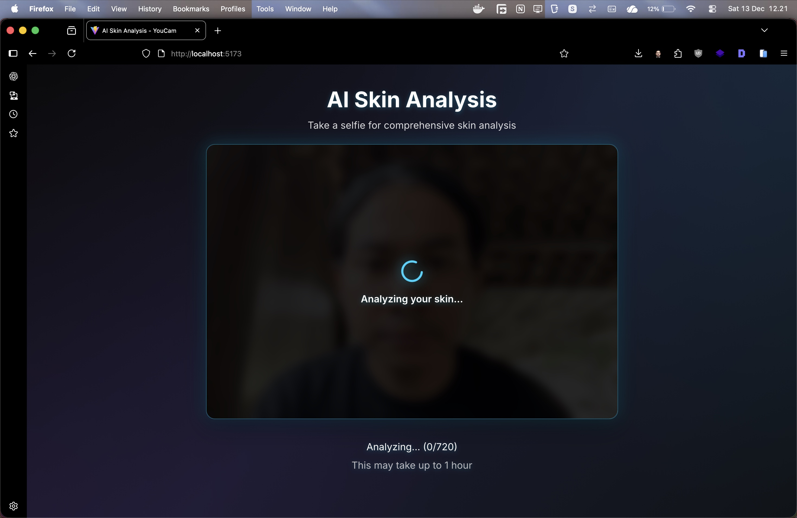
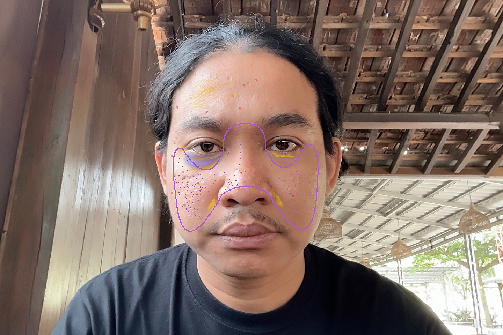

# YouCam Skin Analysis

**YouCam Skin Analysis** adalah demo aplikasi web canggih yang dirancang untuk memberikan pengalaman analisis kulit tingkat profesional secara real-time. Aplikasi ini menyimulasikan pengalaman "Live Camera" untuk mendeteksi berbagai kondisi kulit menggunakan kecerdasan buatan, memberikan wawasan dermatologis instan yang dipresentasikan dalam antarmuka yang modern dan futuristik.

## Tinjauan Proyek

Proyek ini dikembangkan sebagai demonstrasi kemampuan **Fullstack Development** dan **Integrasi AI/Computer Vision**. Fokus utama adalah menciptakan pengalaman pengguna yang seamless, di mana pengguna dapat "mengambil selfie" dan mendapatkan hasil analisis mendalam dalam hitungan detik.

### Demonstrasi Keahlian (Developer Capabilities)

Saya (**Ghaws Shafadonia**) mengembangkan solusi ini untuk membuktikan kompetensi dalam ranah high-level engineering:

*   **Fullstack Architecture Mastery**: Membangun jembatan yang kokoh antara backend yang kompleks (pemrosesan data AI) dan frontend yang responsif.
*   **Implementasi Face Recognition & AI**: Menangani pipeline data biometrik yang sensitif dan kompleks, menerjemahkan data mentah AI menjadi wawasan visual yang mudah dipahami manusia.
*   **Advanced UI/UX Implementation**: Menerjemahkan kebutuhan data yang rumit menjadi dashboard visual yang estetik (Futuristic Dark Theme) dan mudah dibaca, membuktikan kemampuan dalam menciptakan produk digital berstandar industri.
*   **Complex State Management**: Menangani flow asinkronus real-time (scanning, processing, analyzing) untuk memberikan feedback instan kepada pengguna tanpa lag.

## Fitur Utama

- **Instant Selfie Capture**: Antarmuka pengambilan gambar intuitif yang mensimulasikan pengalaman cermin pintar.
- **Analisis Kulit AI Komprehensif**: Mendeteksi 14+ parameter kulit termasuk jerawat, pori-pori, kerutan, dan tekstur secara presisi.
- **Visualisasi Hasil Professional**: Dashboard interaktif yang memecah data kompleks menjadi skor yang mudah dipahami.
- **Deteksi Wajah Presisi**: Algoritma cerdas yang memetakan kontur wajah untuk analisis area spesifik.

## Galeri Demonstrasi

Berikut adalah tampilan antarmuka aplikasi yang telah dikembangkan:

### 1. Antarmuka Pengambilan Selfie (Smart Mirror UI)

| Selfie Capture Mode |
| :---: |
|  |

*Antarmuka "Take a Selfie" dengan desain futuristik, siap untuk memindai wajah pengguna secara real-time.*

### 2. Proses Pemindaian Cerdas

| AI Scanning Process |
| :---: |
|  |

*Visualisasi pemrosesan AI memberikan umpan balik langsung saat sistem menganalisis struktur wajah.*

### 3. Dashboard Hasil Analisis

| Comprehensive Result |
| :---: |
|  |

*Tampilan hasil yang compact dan profesional, menonjolkan skor kesehatan kulit dan area yang perlu perhatian khusus tanpa membingungkan pengguna.*

### 4. Visualisasi Pemetaan Wajah

| Face Mapping Visualization |
| :---: |
|  |

*Overlay visual yang memetakan masalah kulit secara spesifik pada wajah pengguna, menunjukkan presisi deteksi AI.*

#### Legenda Peta Visual (Visual Map Legend)

Setiap warna pada overlay merepresentasikan deteksi kondisi kulit spesifik:

| Warna Visual | Kondisi Terdeteksi (Detected Concern) | Deskripsi |
| :--- | :--- | :--- |
| 🔴 **Merah** | **Acne** (Jerawat) | Mendeteksi area infl amasi dan jerawat aktif |
| 🟠 **Oranye** | **Pore** (Pori-pori) | Menandai area dengan pori-pori yang terlihat membesar |
| 🟡 **Kuning** | **Wrinkle** (Kerutan) | Mengidentifikasi garis halus dan kerutan dalam |
| 🟣 **Ungu** | **Texture** (Tekstur) | Menunjukkan ketidakrataan permukaan kulit |
| 🟤 **Coklat** | **Age Spot** (Flek) | Menandai hiperpigmentasi dan bintik penuaan |
| 🔵 **Indigo** | **Eye Bag** (Kantung Mata) | Mendeteksi pembengkakan di bawah mata |
| 🔵 **Biru** | **Dark Circle** (Lingkaran Hitam) | Mengidentifikasi pigmentasi gelap di area mata |

---

## Skin Analysis Metrics

Sistem ini mampu mendeteksi dan menganalisis metrik kulit secara mendetail:

| Kategori | Parameter Deteksi |
|----------|-------------------|
| **Kondisi Umum** | Jerawat, Pori-pori, Tekstur Kulit |
| **Tanda Penuaan** | Kerutan, Garis Halus, Flek Usia |
| **Area Mata** | Lingkaran Hitam, Kantung Mata, Kelopak Mata Turun |
| **Kesehatan** | Kemerahan, Kadar Minyak, Kelembaban, Kekencangan |

## Informasi Pengembang

**Ghaws Shafadonia**
*Fullstack Developer & AI Integration Specialist*

Email: fafaghaws@live.com
Remote Repository: `git@github.com:gendonholaholo/bitmoji-like.git`
